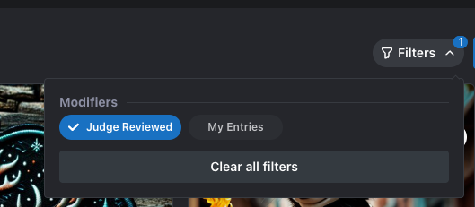
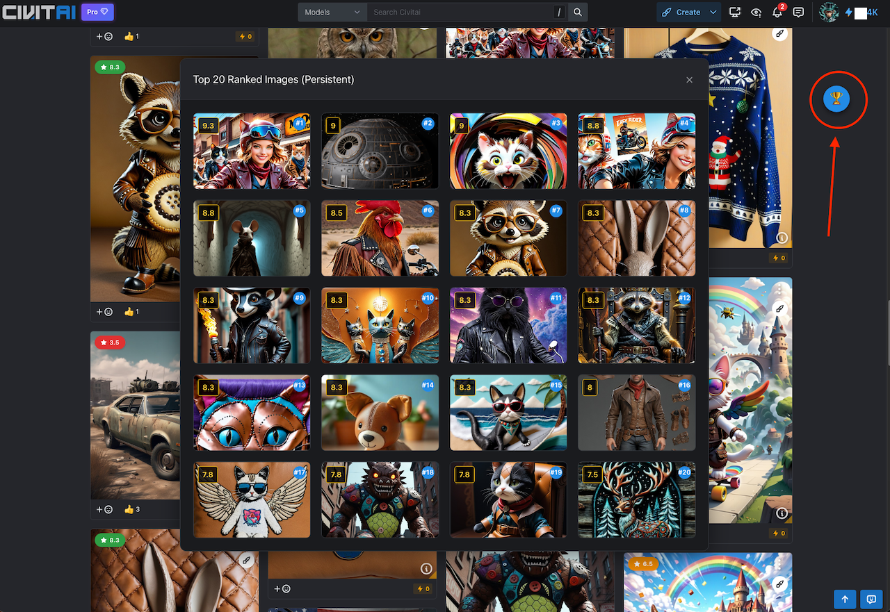

## ⚖️ Disclaimer

This is an **unofficial**, community-created extension and is **not** affiliated with, endorsed by, or connected to Civitai in any way.

**Civitai™** is a trademark of its respective owners. This tool is provided "as is" without warranty of any kind.   

# Challenge Rank 🏆

A Chrome extension that enhances [Civitai Challenges](https://civitai.com/challenges) by automatically finding and ranking images based on their CivBot score. It provides a non-destructive "Top 20" overlay to verify the current leaders without altering the page layout.

## Features

-   **🏆 Top 20 Leaderboard**: Displays a persistent overlay of the top 20 highest-rated images found on the page.
-   **💾 Persistence**: Remembers ranked images as you infinite-scroll, ensuring you don't lose track of top entries even if they leave the viewport.
-   **🔄 Auto-Reset**: Automatically clears the list when you navigate between different challenges.
-   **🖱️ Draggable Button**: The floating "🏆" button can be dragged anywhere on the screen and stays there.
-   **🎯 Smart Filtering**: Automatically attempts to activate the "Judge Reviewed" filter to ensure accurate scoring.
-   **🚫 Smart Parsing**: Correctly ignores content ratings (PG-13, MA) to prevent false score detection.

## Installation

1.  **Download** the `civitai-ranker-release` folder.
2.  Open Chrome and navigate to `chrome://extensions/`.
3.  Enable **Developer mode** (toggle in the top right).
4.  Click **Load unpacked**.
5.  Select the `civitai-ranker-release` folder.

## Usage

1.  Go to any **Civitai Challenge** page (e.g., `https://civitai.com/challenges/...`).
2.  Activate the Judge Review filer 
  
4.  Scroll down to load images. The extension works in the background to find scores.
5.  Click the **Floating 🏆 Button** to open the Top 20 Overlay.
6.  **Click & Drag** the button to move it out of your way.

## Files
-   `manifest.json`: Extension configuration.
-   `content.js`: Main logic for scanning, scoring, and UI.
-   `content.css`: Styling for the overlay and button.
-   `icon.png`: The extension icon.

## Troubleshooting
-   **No scores appearing?** Ensure the "Judge Reviewed" filter is active on the Civitai page.
-   **Extension not showing?** Make sure you are on a URL containing `/challenges/`.
