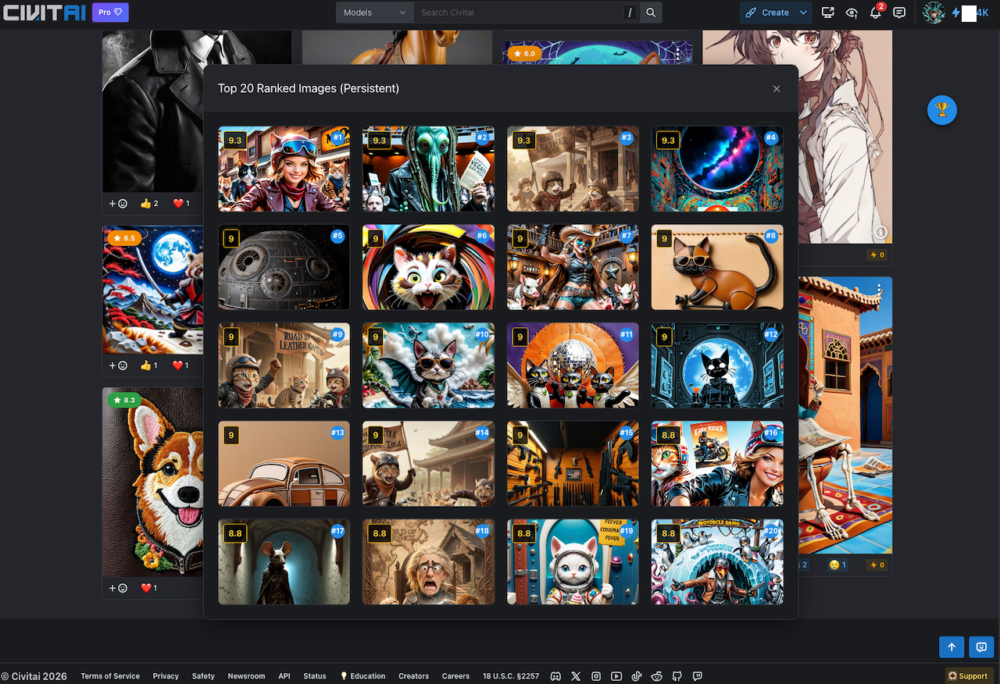
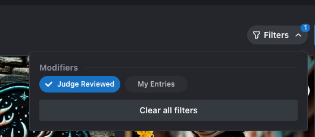

<p align="center">
  
</p>

<h1 align="center">Challenge Rank</h1>

<p align="center">
  <strong>See who's actually winning.</strong><br>
  A Chrome extension that ranks Civitai challenge images by judge score — instantly.
</p>

<p align="center">
  <a href="https://github.com/OuincheWinch/Challenge-Rank/releases/latest">⬇️ Download v1.0.1</a>
</p>

---

## What it does

Civitai challenges show images in random order. This extension scans every loaded image, extracts judge scores, and gives you a **live Top 20 leaderboard** — no guessing, no endless scrolling.

<p align="center">
  
</p>

## Features

| | Feature | Description |
|---|---|---|
| 🏆 | **Top 20 Overlay** | Persistent leaderboard of the highest-scored images, updated live as you scroll |
| 🤖 | **CivBot Details** | Click any score badge to see the full CivBot breakdown (sub-scores & comments) |
| 🎯 | **Auto-Filter** | Automatically activates "Judge Reviewed" so you only see scored entries |
| 💾 | **Persistent Memory** | Remembers ranked images as you infinite-scroll — nothing gets lost |
| 🔄 | **Auto-Reset** | Clears the list when you navigate to a different challenge |
| 🖱️ | **Draggable Button** | The floating 🏆 button can be moved anywhere on screen |

<p align="center">
  
</p>

## Install

1. **Download** the latest [release zip](https://github.com/OuincheWinch/Challenge-Rank/releases/latest)
2. **Unzip** the folder
3. Open `chrome://extensions/` → enable **Developer mode**
4. Click **Load unpacked** → select the unzipped folder

## Usage

1. Go to any [Civitai Challenge](https://civitai.com/challenges) page
2. Scroll to load images — the extension scans scores in the background
3. Click the **🏆 button** to open the Top 20 overlay
4. Click a **score badge** to expand CivBot details

## Extension files

```
manifest.json    → Extension config (permissions, scripts)
content.js       → Core logic: scanning, ranking, overlay UI
content.css      → Styles for overlay, badges, animations
background.js    → Service worker for API calls & cookie auth
icon.png         → Extension icon
```

---

<sub>⚖️ **Disclaimer** — This is an unofficial, community-created extension. Not affiliated with or endorsed by Civitai. Civitai™ is a trademark of its respective owners.</sub>
