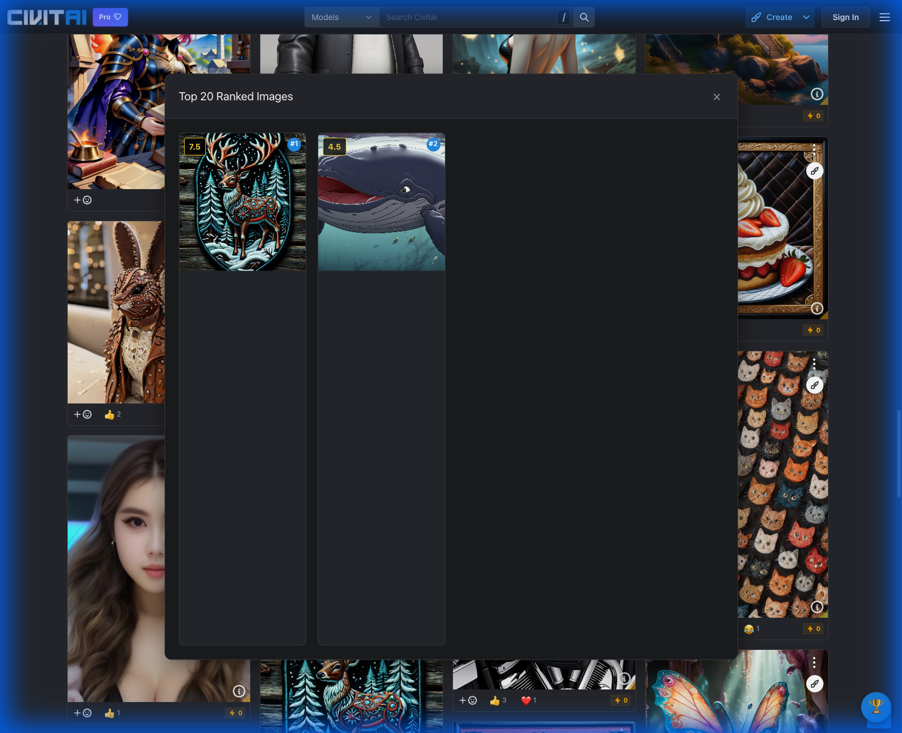

# Challenge Rank: The Missing Leaderboard for Civitai Challenges 🏆

**Ever tried to figure out who is winning a Civitai Challenge?**

It's tough. You have to scroll... and scroll... and scroll. And if you refresh? You lose your place.

**Challenge Rank** fixes this. It's a simple, non-destructive Chrome Extension that works in the background to build a live "Top 20" leaderboard as you browse.

## 🌟 How It Works

1.  **Install the Extension**: (See below).
2.  **Go to a Challenge**: Navigate to any challenge page (e.g., `civitai.com/challenges/...`).
3.  **Browse Normally**: Just scroll down the page. The extension quietly scans every image card it sees.
4.  **Click the Trophy 🏆**: A floating trophy button appears in the bottom right. Click it to see the **Top 20 Highest Rated** images found so far.

## ✨ Key Features

*   **📊 Persistent Leaderboard**: The overlay remembers the best images even if you scroll past them.
*   **🖱️ Draggable Button**: Move the floating trophy button anywhere on your screen.
*   **🧠 Smart Scoring**: It ignores "PG-13" or "10 comments" and finds the *actual* vote score (0-10).
*   **🚫 No broken layouts**: It doesn't try to reorder the grid (which breaks infinite scroll). It just shows you a clean overlay.
*   **⚡ Auto-Reset**: Switching to a new challenge automatically clears the list for you.

## 🛠️ How to Install & Run

Since this is a custom tool, you'll load it as an "Unpacked Extension" in Chrome (or Edge/Brave).

1.  **Download** the extension folder (`challenge-rank-extension`).
2.  Open your browser and search for **Manage Extensions** (or go to `chrome://extensions`).
3.  **Toggle "Developer Mode"** (usually a switch in the top right corner).
4.  Click the **"Load Unpacked"** button.
5.  Select the `challenge-rank-extension` folder.
6.  That's it! Go to a Civitai Challenge page and look for the 🏆.

## 📸 Screenshots

**The Persistent Overlay:**

**The Floating Button:**

---
*Created to make life easier for Civitai challengers!*
